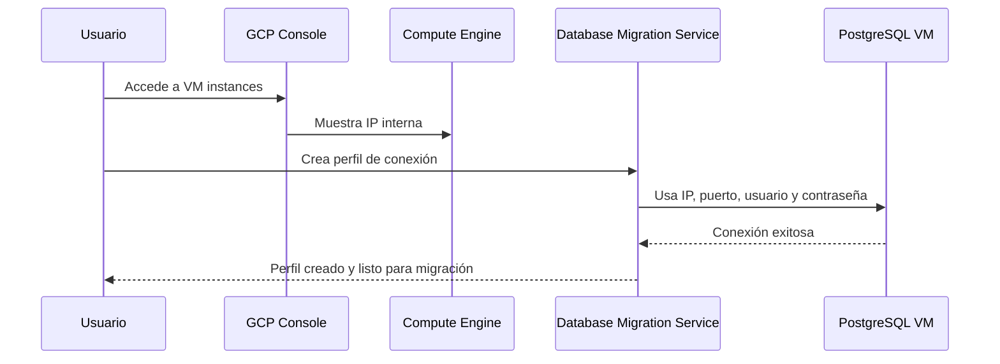
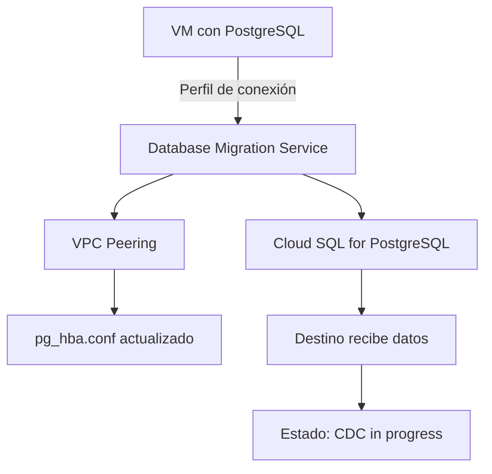
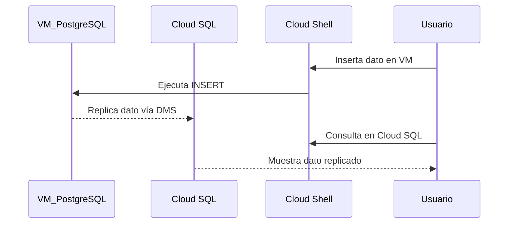
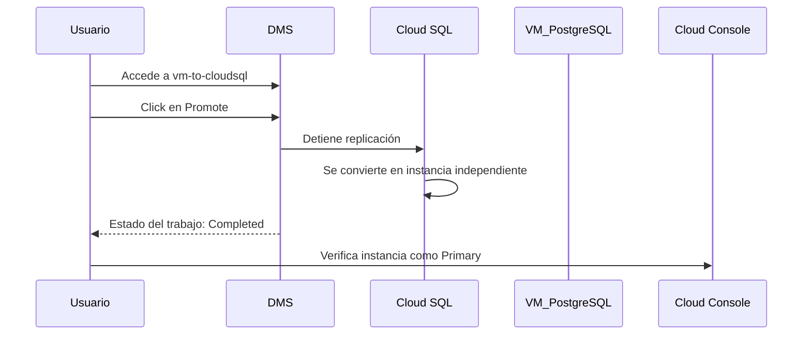

# Migrate to Cloud SQL for PostgreSQL using Database Migration Service

# ID GSP918

 
 
### 🎯 Objetivo del laboratorio

Preparar una instancia de PostgreSQL autoalojada para ser migrada a Cloud SQL mediante **Database Migration Service**, utilizando **replicación lógica** con la extensión `pglogical`.


### 👤 Público objetivo

Este laboratorio está diseñado para:

- Administradores de bases de datos
- Ingenieros de datos
- Arquitectos cloud
- DevOps que trabajan con migraciones a GCP


### 🧩 Componentes clave del laboratorio

- VM con PostgreSQL (`postgresql-vm`)
- Bases de datos: `postgres`, `orders`, `gmemegen_db`
- Usuario de migración: `migration_admin`
- Extensión: `pglogical`
- Herramienta: **Database Migration Service (DMS)**


### ⚙️ Requisitos previos

- Acceso a una VM con PostgreSQL 13
- Acceso a Cloud Shell
- Permisos para instalar paquetes y modificar configuración en la VM
- Familiaridad básica con `psql`


## 🧭 Explicación paso a paso


# Task 1 - Prepare the source database for migration

### 🧱 Paso 1: Instalación de la extensión `pglogical`

📍 **¿Dónde se ejecuta?**  
En la VM `postgresql-vm`, conectándote por SSH desde la consola de GCP.

📌 **¿Qué hace?**  
Instala la extensión que permite replicación lógica entre bases de datos PostgreSQL.

```bash
sudo apt install postgresql-13-pglogical
```

🔎 **¿Para qué sirve?**  
`pglogical` permite replicar datos de forma selectiva usando un modelo de publicación/suscripción, ideal para migraciones sin interrupciones.


### 🧾 Paso 2: Configuración de PostgreSQL para habilitar `pglogical`

📍 **¿Dónde se ejecuta?**  
En la VM, como usuario `postgres`.

📌 **¿Qué hace?**  
Descarga configuraciones adicionales y las agrega a los archivos `pg_hba.conf` y `postgresql.conf`.

```bash
sudo su - postgres -c "gsutil cp gs://cloud-training/gsp918/pg_hba_append.conf ."
sudo su - postgres -c "gsutil cp gs://cloud-training/gsp918/postgresql_append.conf ."
sudo su - postgres -c "cat pg_hba_append.conf >> /etc/postgresql/13/main/pg_hba.conf"
sudo su - postgres -c "cat postgresql_append.conf >> /etc/postgresql/13/main/postgresql.conf"
sudo systemctl restart postgresql@13-main
```

🔎 **¿Para qué sirve?**  
Permite conexiones externas y activa parámetros necesarios para la replicación lógica.

📌 **Configuraciones clave agregadas:**

**En `pg_hba.conf`:**

```conf
#GSP918 - allow access to all hosts
host    all all 0.0.0.0/0   md5
```

**En `postgresql.conf`:**

```conf
#GSP918 - added configuration for pglogical database extension

wal_level = logical         # minimal, replica, or logical
max_worker_processes = 10   # one per database needed on provider node
                            # one per node needed on subscriber node
max_replication_slots = 10  # one per node needed on provider node
max_wal_senders = 10        # one per node needed on provider node
shared_preload_libraries = 'pglogical'
max_wal_size = 1GB
min_wal_size = 80MB

listen_addresses = '*'         # what IP address(es) to listen on, '*' is all
```


### 🧰 Paso 3: Activar la extensión `pglogical` en cada base de datos

📍 **¿Dónde se ejecuta?**  
Dentro del cliente `psql`, como usuario `postgres`.

📌 **¿Qué hace?**  
Activa la extensión en las bases `postgres`, `orders` y `gmemegen_db`.

```bash
sudo su - postgres
psql
```

```sql
\c postgres;
CREATE EXTENSION pglogical;

\c orders;
CREATE EXTENSION pglogical;

\c gmemegen_db;
CREATE EXTENSION pglogical;
```

🔎 **¿Para qué sirve?**  
Permite que cada base pueda participar en la replicación lógica.


### 📋 Paso 4: Verificar bases de datos disponibles

📍 **¿Dónde se ejecuta?**  
En `psql`.

📌 **¿Qué hace?**  
Lista todas las bases de datos en el servidor.

```sql
\l
```

📌 **Salida esperada:**

```text
                               List of databases
    Name     |  Owner   | Encoding | Collate |  Ctype  |   Access privileges   
-------------+----------+----------+---------+---------+-----------------------
 gmemegen_db | postgres | UTF8     | C.UTF-8 | C.UTF-8 |
 orders      | postgres | UTF8     | C.UTF-8 | C.UTF-8 |
 postgres    | postgres | UTF8     | C.UTF-8 | C.UTF-8 |
 template0   | postgres | UTF8     | C.UTF-8 | C.UTF-8 | =c/postgres          +
             |          |          |         |         | postgres=CTc/postgres
 template1   | postgres | UTF8     | C.UTF-8 | C.UTF-8 | =c/postgres          +
             |          |          |         |         | postgres=CTc/postgres
(5 rows)
```


### 👤 Paso 5: Crear usuario `migration_admin`

📍 **¿Dónde se ejecuta?**  
En `psql`.

📌 **¿Qué hace?**  
Crea un usuario con permisos de replicación y lo asigna como dueño de la base `orders`.

```sql
CREATE USER migration_admin PASSWORD 'DMS_1s_cool!';
ALTER DATABASE orders OWNER TO migration_admin;
ALTER ROLE migration_admin WITH REPLICATION;
```


### 🔐 Paso 6: Asignar permisos al usuario `migration_admin`

📍 **¿Dónde se ejecuta?**  
En `psql`, conectándose a cada base.

#### 🔸 En `postgres`:

```sql
\c postgres;
GRANT USAGE ON SCHEMA pglogical TO migration_admin;
GRANT ALL ON SCHEMA pglogical TO migration_admin;

GRANT SELECT ON pglogical.tables TO migration_admin;
GRANT SELECT ON pglogical.depend TO migration_admin;
GRANT SELECT ON pglogical.local_node TO migration_admin;
GRANT SELECT ON pglogical.local_sync_status TO migration_admin;
GRANT SELECT ON pglogical.node TO migration_admin;
GRANT SELECT ON pglogical.node_interface TO migration_admin;
GRANT SELECT ON pglogical.queue TO migration_admin;
GRANT SELECT ON pglogical.replication_set TO migration_admin;
GRANT SELECT ON pglogical.replication_set_seq TO migration_admin;
GRANT SELECT ON pglogical.replication_set_table TO migration_admin;
GRANT SELECT ON pglogical.sequence_state TO migration_admin;
GRANT SELECT ON pglogical.subscription TO migration_admin;
```

#### 🔸 En `orders`:

```sql
\c orders;
GRANT USAGE ON SCHEMA pglogical TO migration_admin;
GRANT ALL ON SCHEMA pglogical TO migration_admin;

GRANT SELECT ON pglogical.tables TO migration_admin;
GRANT SELECT ON pglogical.depend TO migration_admin;
GRANT SELECT ON pglogical.local_node TO migration_admin;
GRANT SELECT ON pglogical.local_sync_status TO migration_admin;
GRANT SELECT ON pglogical.node TO migration_admin;
GRANT SELECT ON pglogical.node_interface TO migration_admin;
GRANT SELECT ON pglogical.queue TO migration_admin;
GRANT SELECT ON pglogical.replication_set TO migration_admin;
GRANT SELECT ON pglogical.replication_set_seq TO migration_admin;
GRANT SELECT ON pglogical.replication_set_table TO migration_admin;
GRANT SELECT ON pglogical.sequence_state TO migration_admin;
GRANT SELECT ON pglogical.subscription TO migration_admin;

GRANT USAGE ON SCHEMA public TO migration_admin;
GRANT ALL ON SCHEMA public TO migration_admin;

GRANT SELECT ON public.distribution_centers TO migration_admin;
GRANT SELECT ON public.inventory_items TO migration_admin;
GRANT SELECT ON public.order_items TO migration_admin;
GRANT SELECT ON public.products TO migration_admin;
GRANT SELECT ON public.users TO migration_admin;
```

#### 🔸 En `gmemegen_db`:

```sql
\c gmemegen_db;
GRANT USAGE ON SCHEMA pglogical TO migration_admin;
GRANT ALL ON SCHEMA pglogical TO migration_admin;

GRANT SELECT ON pglogical.tables TO migration_admin;
GRANT SELECT ON pglogical.depend TO migration_admin;
GRANT SELECT ON pglogical.local_node TO migration_admin;
GRANT SELECT ON pglogical.local_sync_status TO migration_admin;
GRANT SELECT ON pglogical.node TO migration_admin;
GRANT SELECT ON pglogical.node_interface TO migration_admin;
GRANT SELECT ON pglogical.queue TO migration_admin;
GRANT SELECT ON pglogical.replication_set TO migration_admin;
GRANT SELECT ON pglogical.replication_set_seq TO migration_admin;
GRANT SELECT ON pglogical.replication_set_table TO migration_admin;
GRANT SELECT ON pglogical.sequence_state TO migration_admin;
GRANT SELECT ON pglogical.subscription TO migration_admin;

GRANT USAGE ON SCHEMA public TO migration_admin;
GRANT ALL ON SCHEMA public TO migration_admin;

GRANT SELECT ON public.meme TO migration_admin;
```


### 🧑‍🔧 Paso 7: Transferir propiedad de tablas en `orders`

📍 **¿Dónde se ejecuta?**  
En `psql`, conectado a `orders`.

📌 **¿Qué hace?**  
Asigna al usuario `migration_admin` como dueño de las tablas.

```sql
\c orders;
\dt

ALTER TABLE public.distribution_centers OWNER TO migration_admin;
ALTER TABLE public.inventory_items OWNER TO migration_admin;
ALTER TABLE public.order_items OWNER TO migration_admin;
ALTER TABLE public.products OWNER TO migration_admin;
ALTER TABLE public.users OWNER TO migration_admin;

\dt
```

📌 **Salida esperada:**

```text
               List of relations
 Schema |         Name         | Type  | Owner
--------+----------------------+-------+----------------
 public | distribution_centers | table | migration_admin
 public | inventory_items      | table | migration_admin
 public | order_items          | table | migration_admin
 public | products             | table | migration_admin
 public | users                | table | migration_admin
(5 rows)
```


### 🚪 Paso 8: Salir de `psql` y sesión de `postgres`

```sql
\q
exit
```


### ✅ Resultado final

Las bases de datos `postgres`, `orders` y `gmemegen_db` están listas para ser migradas usando **Database Migration Service**. El usuario `migration_admin` tiene todos los permisos necesarios.

---
 
# Task 2 - Create a Database Migration Service connection profile for a stand-alone PostgreSQL database


### 🎯 Descripción  

Crear un **perfil de conexión** en **Database Migration Service (DMS)** que permita conectarse a una instancia PostgreSQL autoalojada (stand-alone) para iniciar una migración hacia Cloud SQL.


 
 
## 🧭 Explicación paso a paso


### 🔍 Paso 1: Obtener la IP interna de la instancia PostgreSQL

📍 **¿Dónde se ejecuta?**  
En la **Google Cloud Console**.

📌 **¿Qué hace?**  
Identifica la IP interna de la VM `postgresql-vm`, necesaria para configurar la conexión.

📌 **Ruta de navegación:**

`Cloud Console → Navigation menu → Compute Engine → VM instances`

📌 **Acción:**

- Localiza la instancia llamada `postgresql-vm`
- Copia el valor de **Internal IP** (por ejemplo: `10.128.0.2`)

🔎 **¿Para qué sirve?**  
Esta IP será usada por DMS para conectarse a la base de datos fuente.


### 🧰 Paso 2: Crear el perfil de conexión en DMS

📍 **¿Dónde se ejecuta?**  
En la **Google Cloud Console**, dentro del servicio **Database Migration**.

📌 **¿Qué hace?**  
Crea un perfil que almacena la información de conexión a la base de datos PostgreSQL fuente.

📌 **Ruta de navegación:**

`Cloud Console → Navigation menu → VIEW ALL PRODUCTS → Databases → Database Migration → Connection profiles`

📌 **Acciones detalladas:**

1. Haz clic en **+ Create Profile**
2. En **Profile Role**, selecciona `Source`
3. En **Database engine**, selecciona `PostgreSQL`
4. En **Connection profile name**, escribe: `postgres-vm`
5. En **Region**, selecciona la región donde está tu VM (por ejemplo: `us-central1`)
6. En **Define connection configurations**, haz clic en **DEFINE**
7. Completa los siguientes campos:

   - **Hostname or IP address**: `10.128.0.2` (IP interna copiada anteriormente)
   - **Port**: `5432`
   - **Username**: `migration_admin`
   - **Password**: `DMS_1s_cool!`

8. Deja los demás valores por defecto
9. Haz clic en **Create**

📌 **Resultado esperado:**

- Se crea un nuevo perfil de conexión llamado `postgres-vm`
- Este perfil aparece en la lista de **Connection profiles**

🔎 **¿Para qué sirve?**  
Este perfil será usado por DMS para conectarse a la base de datos fuente y ejecutar la migración.


### ✅ Verificación

📌 **Acción final:**

Haz clic en **Check my progress** para verificar que el objetivo fue cumplido correctamente.


### 🗺️ Visualización del flujo de conexión




## ✅ Resultado final

Ya tienes un **perfil de conexión funcional** que permite a Database Migration Service acceder a tu instancia PostgreSQL autoalojada. Este perfil será reutilizado en tareas posteriores para configurar y ejecutar la migración hacia Cloud SQL.

---

# Task 3 - Create and start a continuous migration job

## 🧭 Descripción    

Este laboratorio guía al usuario en la creación de una **tarea de migración continua** desde una instancia de PostgreSQL alojada en una VM hacia una instancia gestionada de **Cloud SQL for PostgreSQL** usando **Database Migration Service (DMS)**.


## 🎯 Objetivos  

- Crear una instancia de Cloud SQL como destino.
- Configurar una tarea de migración continua.
- Establecer conectividad entre origen y destino.
- Asegurar el acceso mediante configuración de red y seguridad.
- Validar y ejecutar la migración.


 

## 🧩 Componentes clave del laboratorio

- **Database Migration Service (DMS)**
- **Cloud SQL for PostgreSQL**
- **Compute Engine (VM con PostgreSQL)**
- **VPC Peering**
- **pg_hba.conf**
- **Service Networking API**


 


## 🔍 Explicación paso a paso

### 🔹 Paso 1: Crear el trabajo de migración continua

**¿Qué hace?**  
Define el tipo de migración y los motores de base de datos involucrados.

**¿Para qué sirve?**  
Establece el marco de trabajo para que DMS sepa qué migrar, desde dónde y hacia dónde.

**Acciones:**

1. Ir a `Cloud Console → Databases → Database Migration → Migration jobs`.
2. Click en `+ Create Migration Job`.
3. Configurar:
   - Nombre: `vm-to-cloudsql`
   - Origen: PostgreSQL
   - Destino: Cloud SQL for PostgreSQL
   - Región: *(seleccionar)*
   - Tipo de migración: `Continuous`
4. Click en `Save & Continue`.


### 🔹 Paso 2: Definir la instancia de origen

**¿Qué hace?**  
Selecciona el perfil de conexión que representa la base de datos PostgreSQL en la VM.

**¿Para qué sirve?**  
Permite que DMS sepa cómo conectarse al origen.

**Acciones:**

1. Seleccionar el perfil `postgres-vm`.
2. Revisar detalles como IP, puerto, usuario, cifrado.
3. Click en `Save & Continue`.


### 🔹 Paso 3: Crear la instancia de destino (Cloud SQL)

**¿Qué hace?**  
Crea una nueva instancia de Cloud SQL que recibirá los datos migrados.

**¿Para qué sirve?**  
Es el nuevo entorno gestionado donde se alojará la base de datos.

**Acciones:**

1. ID de instancia: `postgresql-cloudsql`
2. Contraseña: `supersecret!`
3. Edición: `Enterprise`
4. Versión: PostgreSQL 13
5. Zona: *(seleccionar)*
6. IP: `Privada y Pública`
7. Rango IP: `Automático`
8. Click en `Allocate & Connect`

**Nota:**  
Este paso puede tardar. Si aparece un error, usar `Retry`.


### 🔹 Paso 4: Configurar forma de conectividad

**¿Qué hace?**  
Establece cómo se conectarán origen y destino (VPC Peering).

**¿Para qué sirve?**  
Permite que DMS acceda a la base de datos en la VM de forma segura.

**Acciones:**

1. Método: `VPC Peering`
2. VPC: `default`
3. Click en `Configure & Continue` cuando la instancia esté lista.


### 🔹 Paso 5: Permitir acceso desde el rango IP asignado

**¿Qué hace?**  
Modifica el archivo `pg_hba.conf` para permitir conexiones desde el rango IP de DMS.

**¿Para qué sirve?**  
Evita que la VM rechace conexiones desde Cloud SQL.

**Acciones:**

1. Obtener el rango IP desde `Cloud Console → VPC Network → VPC Network Peering → Effective Routes`.
2. Copiar el rango (ej. `10.107.176.0/24`).
3. En la VM, ejecutar:

```bash
sudo nano /etc/postgresql/13/main/pg_hba.conf
```

4. Reemplazar:

```bash
host    all all 0.0.0.0/0   md5
```

por:

```bash
host    all all 10.107.176.0/24   md5
```

5. Guardar y salir (`Ctrl+O`, `Enter`, `Ctrl+X`).
6. Reiniciar PostgreSQL:

```bash
sudo systemctl start postgresql@13-main
```


### 🔹 Paso 6: Probar y arrancar el trabajo de migración

**¿Qué hace?**  
Verifica que todo esté correctamente configurado y comienza la migración.

**¿Para qué sirve?**  
Evita errores antes de iniciar el proceso de migración.

**Acciones:**

1. Click en `Test Job`.
2. Si es exitoso, click en `Create & Start Job`.


### 🔹 Paso 7: Verificar el estado del trabajo

**¿Qué hace?**  
Muestra el progreso de la migración.

**¿Para qué sirve?**  
Permite saber si el proceso está activo y en qué etapa se encuentra.

**Estados posibles:**

- `Not started`: aún no iniciado.
- `Starting`: inicializando.
- `Running Full dump in progress`: migrando datos iniciales.
- `Running CDC in progress`: sincronización continua activa.


## 📊 Visualización del flujo de migración



---


# Task 4 - Confirm the data in Cloud SQL for PostgreSQL


 ## 🧭 Descripción general  

Esta tarea te guía para:

1. Verificar que las bases de datos se hayan migrado correctamente a Cloud SQL.
2. Conectarte a la instancia destino usando Cloud Shell.
3. Consultar datos migrados.
4. Insertar nuevos datos en la base de datos fuente (VM).
5. Confirmar que esos datos se replican automáticamente en la instancia destino.


## 🎯 Objetivos del laboratorio

- Validar la migración inicial de datos.
- Probar la replicación continua (CDC - Change Data Capture).
- Confirmar conectividad entre origen y destino.
- Verificar consistencia de datos.

  de PostgreSQL)**

 

## 🔍 Explicación paso a paso
 
### 🔹 Paso 1: Verificar bases de datos migradas en Cloud SQL

**¿Qué hace?**  
Confirma que las bases de datos del origen fueron replicadas en la instancia destino.

**¿Para qué sirve?**  
Verifica que la migración inicial se completó correctamente.

**Acciones:**

1. Ir a `Cloud Console → SQL`.
2. Expandir la instancia `postgresql-cloudsql-master`.
3. Seleccionar la réplica `postgresql-cloudsql`.
4. En el menú lateral, hacer clic en `Databases`.

**Resultado esperado:**  
Verás las bases de datos: `postgres`, `orders` y `gmemegen_db`.


### 🔹 Paso 2: Conectarse a la instancia destino desde Cloud Shell

**¿Qué hace?**  
Abre una sesión interactiva con PostgreSQL en Cloud SQL.

**¿Para qué sirve?**  
Permite ejecutar comandos SQL directamente en la base de datos migrada.

**Acciones:**

1. En `Cloud Console → SQL → postgresql-cloudsql → Overview`.
2. Ir a la sección `Connect to this instance`.
3. Click en `Open Cloud Shell`.
4. Ejecutar el comando prellenado:

```bash
gcloud sql connect postgresql-cloudsql --user=postgres --quiet
```

5. Autorizar el API si se solicita.
6. Ingresar la contraseña: `supersecret!`

**Resultado esperado:**  
Acceso al prompt interactivo de PostgreSQL (`psql`).


### 🔹 Paso 3: Consultar datos en la base de datos migrada

**¿Qué hace?**  
Verifica que los datos del origen están presentes en el destino.

**¿Para qué sirve?**  
Confirma que la migración inicial fue exitosa.

**Acciones:**

1. Cambiar a la base de datos `orders`:

```sql
\c orders;
```

2. Ingresar contraseña: `supersecret!`
3. Consultar la tabla `distribution_centers`:

```sql
select * from distribution_centers;
```

**Salida esperada:**
```text
 longitude | latitude | name                     | id
-----------+----------+--------------------------+----
 -89.9711  | 35.1174  | Memphis TN               |  1
 -87.6847  | 41.8369  | Chicago IL               |  2
 ...
 -81.1167  | 32.0167  | Savannah GA              | 10
```


4. Salir del prompt:

```sql
\q
```


### 🔹 Paso 4: Insertar nuevos datos en la base de datos fuente (VM)

**¿Qué hace?**  
Agrega un nuevo registro en la base de datos original para probar la replicación continua.

**¿Para qué sirve?**  
Verifica que los cambios en el origen se reflejan en el destino.

**Acciones:**

1. En Cloud Shell, ejecutar:

```bash
export VM_NAME=postgresql-vm
export PROJECT_ID=$(gcloud config list --format 'value(core.project)')
export POSTGRESQL_IP=$(gcloud compute instances describe ${VM_NAME} \
  --zone=(zone) --format="value(networkInterfaces[0].accessConfigs[0].natIP)")
echo $POSTGRESQL_IP
```

2. Conectarse a la VM:

```bash
psql -h $POSTGRESQL_IP -p 5432 -d orders -U migration_admin
```

3. Ingresar contraseña: `DMS_1s_cool!`

4. Cambiar a la base de datos:

```sql
\c orders;
```

5. Insertar nuevo registro:

```sql
insert into distribution_centers values(-80.1918,25.7617,'Miami FL',11);
```

6. Salir del prompt:

```sql
\q
```


### 🔹 Paso 5: Verificar que el nuevo dato se replicó en Cloud SQL

**¿Qué hace?**  
Confirma que el nuevo dato insertado en la VM fue replicado en Cloud SQL.

**¿Para qué sirve?**  
Valida que la migración continua está funcionando correctamente.

**Acciones:**

1. Conectarse nuevamente a Cloud SQL:

```bash
gcloud sql connect postgresql-cloudsql --user=postgres --quiet
```

2. Ingresar contraseña: `supersecret!`

3. Cambiar a la base de datos:

```sql
\c orders;
```

4. Consultar la tabla:

```sql
select * from distribution_centers;
```

**Salida esperada:**

```text
...
 -81.1167  | 32.0167  | Savannah GA              | 10
 -80.1918  | 25.7617  | Miami FL                 | 11
```

5. Salir del prompt:

```sql
\q
```


## 🗺️ Visualización del flujo de replicación continua




## ✅ Resultado esperado

- Bases de datos migradas visibles en Cloud SQL.
- Conexión exitosa a Cloud SQL vía Cloud Shell.
- Datos originales presentes en la tabla `distribution_centers`.
- Nuevo dato (`Miami FL`) replicado correctamente.
- Validación de que la migración continua está activa y funcional.
  
---

# Task 5. Promote Cloud SQL to be a stand-alone instance for reading and writing data


## 🧭 Descripción general  

Esta tarea finaliza el proceso de migración continua promoviendo la instancia de destino (`Cloud SQL for PostgreSQL`) como una base de datos **independiente**, lo que significa que ya no depende del origen (VM) y puede operar como sistema principal de lectura/escritura.


## 🎯 Objetivos del laboratorio

- Finalizar la migración continua.
- Promover la instancia destino como principal.
- Validar que la instancia Cloud SQL está lista para producción.
 
 
 
## 🔍 Explicación paso a paso


### 🔹 Paso 1: Acceder al trabajo de migración

**¿Qué hace?**  
Abre la página de detalles del trabajo de migración.

**¿Para qué sirve?**  
Permite visualizar el estado actual y realizar acciones como la promoción.

**Ruta de navegación:**  
`Cloud Console → Databases → Database Migration → Migration jobs`

**Acciones:**

1. Buscar el trabajo llamado `vm-to-cloudsql`.
2. Hacer clic para abrir su página de detalles.


### 🔹 Paso 2: Promover la instancia destino

**¿Qué hace?**  
Convierte la instancia `postgresql-cloudsql` en una base de datos independiente.

**¿Para qué sirve?**  
Finaliza la sincronización continua y permite que la instancia sea usada como principal para operaciones de lectura y escritura.

**Acciones:**

1. En la página del trabajo de migración, hacer clic en `Promote`.
2. Confirmar la acción si se solicita.

**Resultado esperado:**  
El estado del trabajo cambia a `Completed`.


### 🔹 Paso 3: Verificar que la instancia fue promovida

**¿Qué hace?**  
Confirma que la instancia `postgresql-cloudsql` ya no es una réplica, sino una instancia principal.

**¿Para qué sirve?**  
Valida que la migración ha terminado y que la base de datos está lista para producción.

**Ruta de navegación:**  
`Cloud Console → Databases → SQL`

**Acciones:**

1. Buscar la instancia `postgresql-cloudsql`.
2. Verificar que está etiquetada como **Primary Instance**.


## 🗺️ Visualización del flujo de promoción




## ✅ Resultado esperado

- El trabajo de migración `vm-to-cloudsql` aparece como **Completed**.
- La instancia `postgresql-cloudsql` está marcada como **Primary**.
- Ya no hay dependencia de la VM origen.
- La base de datos está lista para operaciones de lectura y escritura.


## 📝 Notas importantes

- **Después de la promoción**, los cambios en la VM **ya no se replican**.
- Es recomendable **desactivar o eliminar** la instancia origen si ya no se usará.
- Puedes configurar backups, alertas y monitoreo en Cloud SQL para producción.
