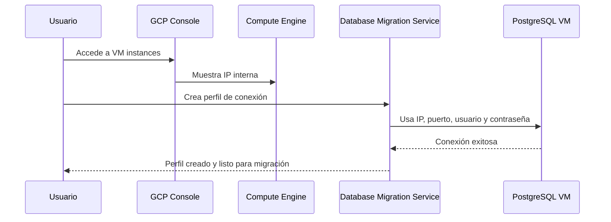

# Migrate to Cloud SQL for PostgreSQL using Database Migration Service

# ID GSP918

 
 
### 🎯 Objetivo del laboratorio

Preparar una instancia de PostgreSQL autoalojada para ser migrada a Cloud SQL mediante **Database Migration Service**, utilizando **replicación lógica** con la extensión `pglogical`.


### 👤 Público objetivo

Este laboratorio está diseñado para:

- Administradores de bases de datos
- Ingenieros de datos
- Arquitectos cloud
- DevOps que trabajan con migraciones a GCP


### 🧩 Componentes clave del laboratorio

- VM con PostgreSQL (`postgresql-vm`)
- Bases de datos: `postgres`, `orders`, `gmemegen_db`
- Usuario de migración: `migration_admin`
- Extensión: `pglogical`
- Herramienta: **Database Migration Service (DMS)**


### ⚙️ Requisitos previos

- Acceso a una VM con PostgreSQL 13
- Acceso a Cloud Shell
- Permisos para instalar paquetes y modificar configuración en la VM
- Familiaridad básica con `psql`


## 🧭 Explicación paso a paso


# Task 1 - Prepare the source database for migration

### 🧱 Paso 1: Instalación de la extensión `pglogical`

📍 **¿Dónde se ejecuta?**  
En la VM `postgresql-vm`, conectándote por SSH desde la consola de GCP.

📌 **¿Qué hace?**  
Instala la extensión que permite replicación lógica entre bases de datos PostgreSQL.

```bash
sudo apt install postgresql-13-pglogical
```

🔎 **¿Para qué sirve?**  
`pglogical` permite replicar datos de forma selectiva usando un modelo de publicación/suscripción, ideal para migraciones sin interrupciones.


### 🧾 Paso 2: Configuración de PostgreSQL para habilitar `pglogical`

📍 **¿Dónde se ejecuta?**  
En la VM, como usuario `postgres`.

📌 **¿Qué hace?**  
Descarga configuraciones adicionales y las agrega a los archivos `pg_hba.conf` y `postgresql.conf`.

```bash
sudo su - postgres -c "gsutil cp gs://cloud-training/gsp918/pg_hba_append.conf ."
sudo su - postgres -c "gsutil cp gs://cloud-training/gsp918/postgresql_append.conf ."
sudo su - postgres -c "cat pg_hba_append.conf >> /etc/postgresql/13/main/pg_hba.conf"
sudo su - postgres -c "cat postgresql_append.conf >> /etc/postgresql/13/main/postgresql.conf"
sudo systemctl restart postgresql@13-main
```

🔎 **¿Para qué sirve?**  
Permite conexiones externas y activa parámetros necesarios para la replicación lógica.

📌 **Configuraciones clave agregadas:**

**En `pg_hba.conf`:**

```conf
#GSP918 - allow access to all hosts
host    all all 0.0.0.0/0   md5
```

**En `postgresql.conf`:**

```conf
#GSP918 - added configuration for pglogical database extension

wal_level = logical         # minimal, replica, or logical
max_worker_processes = 10   # one per database needed on provider node
                            # one per node needed on subscriber node
max_replication_slots = 10  # one per node needed on provider node
max_wal_senders = 10        # one per node needed on provider node
shared_preload_libraries = 'pglogical'
max_wal_size = 1GB
min_wal_size = 80MB

listen_addresses = '*'         # what IP address(es) to listen on, '*' is all
```


### 🧰 Paso 3: Activar la extensión `pglogical` en cada base de datos

📍 **¿Dónde se ejecuta?**  
Dentro del cliente `psql`, como usuario `postgres`.

📌 **¿Qué hace?**  
Activa la extensión en las bases `postgres`, `orders` y `gmemegen_db`.

```bash
sudo su - postgres
psql
```

```sql
\c postgres;
CREATE EXTENSION pglogical;

\c orders;
CREATE EXTENSION pglogical;

\c gmemegen_db;
CREATE EXTENSION pglogical;
```

🔎 **¿Para qué sirve?**  
Permite que cada base pueda participar en la replicación lógica.


### 📋 Paso 4: Verificar bases de datos disponibles

📍 **¿Dónde se ejecuta?**  
En `psql`.

📌 **¿Qué hace?**  
Lista todas las bases de datos en el servidor.

```sql
\l
```

📌 **Salida esperada:**

```text
                               List of databases
    Name     |  Owner   | Encoding | Collate |  Ctype  |   Access privileges   
-------------+----------+----------+---------+---------+-----------------------
 gmemegen_db | postgres | UTF8     | C.UTF-8 | C.UTF-8 |
 orders      | postgres | UTF8     | C.UTF-8 | C.UTF-8 |
 postgres    | postgres | UTF8     | C.UTF-8 | C.UTF-8 |
 template0   | postgres | UTF8     | C.UTF-8 | C.UTF-8 | =c/postgres          +
             |          |          |         |         | postgres=CTc/postgres
 template1   | postgres | UTF8     | C.UTF-8 | C.UTF-8 | =c/postgres          +
             |          |          |         |         | postgres=CTc/postgres
(5 rows)
```


### 👤 Paso 5: Crear usuario `migration_admin`

📍 **¿Dónde se ejecuta?**  
En `psql`.

📌 **¿Qué hace?**  
Crea un usuario con permisos de replicación y lo asigna como dueño de la base `orders`.

```sql
CREATE USER migration_admin PASSWORD 'DMS_1s_cool!';
ALTER DATABASE orders OWNER TO migration_admin;
ALTER ROLE migration_admin WITH REPLICATION;
```


### 🔐 Paso 6: Asignar permisos al usuario `migration_admin`

📍 **¿Dónde se ejecuta?**  
En `psql`, conectándose a cada base.

#### 🔸 En `postgres`:

```sql
\c postgres;
GRANT USAGE ON SCHEMA pglogical TO migration_admin;
GRANT ALL ON SCHEMA pglogical TO migration_admin;

GRANT SELECT ON pglogical.tables TO migration_admin;
GRANT SELECT ON pglogical.depend TO migration_admin;
GRANT SELECT ON pglogical.local_node TO migration_admin;
GRANT SELECT ON pglogical.local_sync_status TO migration_admin;
GRANT SELECT ON pglogical.node TO migration_admin;
GRANT SELECT ON pglogical.node_interface TO migration_admin;
GRANT SELECT ON pglogical.queue TO migration_admin;
GRANT SELECT ON pglogical.replication_set TO migration_admin;
GRANT SELECT ON pglogical.replication_set_seq TO migration_admin;
GRANT SELECT ON pglogical.replication_set_table TO migration_admin;
GRANT SELECT ON pglogical.sequence_state TO migration_admin;
GRANT SELECT ON pglogical.subscription TO migration_admin;
```

#### 🔸 En `orders`:

```sql
\c orders;
GRANT USAGE ON SCHEMA pglogical TO migration_admin;
GRANT ALL ON SCHEMA pglogical TO migration_admin;

GRANT SELECT ON pglogical.tables TO migration_admin;
GRANT SELECT ON pglogical.depend TO migration_admin;
GRANT SELECT ON pglogical.local_node TO migration_admin;
GRANT SELECT ON pglogical.local_sync_status TO migration_admin;
GRANT SELECT ON pglogical.node TO migration_admin;
GRANT SELECT ON pglogical.node_interface TO migration_admin;
GRANT SELECT ON pglogical.queue TO migration_admin;
GRANT SELECT ON pglogical.replication_set TO migration_admin;
GRANT SELECT ON pglogical.replication_set_seq TO migration_admin;
GRANT SELECT ON pglogical.replication_set_table TO migration_admin;
GRANT SELECT ON pglogical.sequence_state TO migration_admin;
GRANT SELECT ON pglogical.subscription TO migration_admin;

GRANT USAGE ON SCHEMA public TO migration_admin;
GRANT ALL ON SCHEMA public TO migration_admin;

GRANT SELECT ON public.distribution_centers TO migration_admin;
GRANT SELECT ON public.inventory_items TO migration_admin;
GRANT SELECT ON public.order_items TO migration_admin;
GRANT SELECT ON public.products TO migration_admin;
GRANT SELECT ON public.users TO migration_admin;
```

#### 🔸 En `gmemegen_db`:

```sql
\c gmemegen_db;
GRANT USAGE ON SCHEMA pglogical TO migration_admin;
GRANT ALL ON SCHEMA pglogical TO migration_admin;

GRANT SELECT ON pglogical.tables TO migration_admin;
GRANT SELECT ON pglogical.depend TO migration_admin;
GRANT SELECT ON pglogical.local_node TO migration_admin;
GRANT SELECT ON pglogical.local_sync_status TO migration_admin;
GRANT SELECT ON pglogical.node TO migration_admin;
GRANT SELECT ON pglogical.node_interface TO migration_admin;
GRANT SELECT ON pglogical.queue TO migration_admin;
GRANT SELECT ON pglogical.replication_set TO migration_admin;
GRANT SELECT ON pglogical.replication_set_seq TO migration_admin;
GRANT SELECT ON pglogical.replication_set_table TO migration_admin;
GRANT SELECT ON pglogical.sequence_state TO migration_admin;
GRANT SELECT ON pglogical.subscription TO migration_admin;

GRANT USAGE ON SCHEMA public TO migration_admin;
GRANT ALL ON SCHEMA public TO migration_admin;

GRANT SELECT ON public.meme TO migration_admin;
```


### 🧑‍🔧 Paso 7: Transferir propiedad de tablas en `orders`

📍 **¿Dónde se ejecuta?**  
En `psql`, conectado a `orders`.

📌 **¿Qué hace?**  
Asigna al usuario `migration_admin` como dueño de las tablas.

```sql
\c orders;
\dt

ALTER TABLE public.distribution_centers OWNER TO migration_admin;
ALTER TABLE public.inventory_items OWNER TO migration_admin;
ALTER TABLE public.order_items OWNER TO migration_admin;
ALTER TABLE public.products OWNER TO migration_admin;
ALTER TABLE public.users OWNER TO migration_admin;

\dt
```

📌 **Salida esperada:**

```text
               List of relations
 Schema |         Name         | Type  | Owner
--------+----------------------+-------+----------------
 public | distribution_centers | table | migration_admin
 public | inventory_items      | table | migration_admin
 public | order_items          | table | migration_admin
 public | products             | table | migration_admin
 public | users                | table | migration_admin
(5 rows)
```


### 🚪 Paso 8: Salir de `psql` y sesión de `postgres`

```sql
\q
exit
```


### ✅ Resultado final

Las bases de datos `postgres`, `orders` y `gmemegen_db` están listas para ser migradas usando **Database Migration Service**. El usuario `migration_admin` tiene todos los permisos necesarios.

---
 
# Task 2 - Create a Database Migration Service connection profile for a stand-alone PostgreSQL database


### 🎯 Objetivo  

Crear un **perfil de conexión** en **Database Migration Service (DMS)** que permita conectarse a una instancia PostgreSQL autoalojada (stand-alone) para iniciar una migración hacia Cloud SQL.


 
 
## 🧭 Explicación paso a paso


### 🔍 Paso 1: Obtener la IP interna de la instancia PostgreSQL

📍 **¿Dónde se ejecuta?**  
En la **Google Cloud Console**.

📌 **¿Qué hace?**  
Identifica la IP interna de la VM `postgresql-vm`, necesaria para configurar la conexión.

📌 **Ruta de navegación:**

`Cloud Console → Navigation menu → Compute Engine → VM instances`

📌 **Acción:**

- Localiza la instancia llamada `postgresql-vm`
- Copia el valor de **Internal IP** (por ejemplo: `10.128.0.2`)

🔎 **¿Para qué sirve?**  
Esta IP será usada por DMS para conectarse a la base de datos fuente.


### 🧰 Paso 2: Crear el perfil de conexión en DMS

📍 **¿Dónde se ejecuta?**  
En la **Google Cloud Console**, dentro del servicio **Database Migration**.

📌 **¿Qué hace?**  
Crea un perfil que almacena la información de conexión a la base de datos PostgreSQL fuente.

📌 **Ruta de navegación:**

`Cloud Console → Navigation menu → VIEW ALL PRODUCTS → Databases → Database Migration → Connection profiles`

📌 **Acciones detalladas:**

1. Haz clic en **+ Create Profile**
2. En **Profile Role**, selecciona `Source`
3. En **Database engine**, selecciona `PostgreSQL`
4. En **Connection profile name**, escribe: `postgres-vm`
5. En **Region**, selecciona la región donde está tu VM (por ejemplo: `us-central1`)
6. En **Define connection configurations**, haz clic en **DEFINE**
7. Completa los siguientes campos:

   - **Hostname or IP address**: `10.128.0.2` (IP interna copiada anteriormente)
   - **Port**: `5432`
   - **Username**: `migration_admin`
   - **Password**: `DMS_1s_cool!`

8. Deja los demás valores por defecto
9. Haz clic en **Create**

📌 **Resultado esperado:**

- Se crea un nuevo perfil de conexión llamado `postgres-vm`
- Este perfil aparece en la lista de **Connection profiles**

🔎 **¿Para qué sirve?**  
Este perfil será usado por DMS para conectarse a la base de datos fuente y ejecutar la migración.


### ✅ Verificación

📌 **Acción final:**

Haz clic en **Check my progress** para verificar que el objetivo fue cumplido correctamente.


### 🗺️ Visualización del flujo de conexión




## ✅ Resultado final

Ya tienes un **perfil de conexión funcional** que permite a Database Migration Service acceder a tu instancia PostgreSQL autoalojada. Este perfil será reutilizado en tareas posteriores para configurar y ejecutar la migración hacia Cloud SQL.


# Task 3 - Create and start a continuous migration job


# Task 4 - Confirm the data in Cloud SQL for PostgreSQL

# Task 5. Promote Cloud SQL to be a stand-alone instance for reading and writing data
