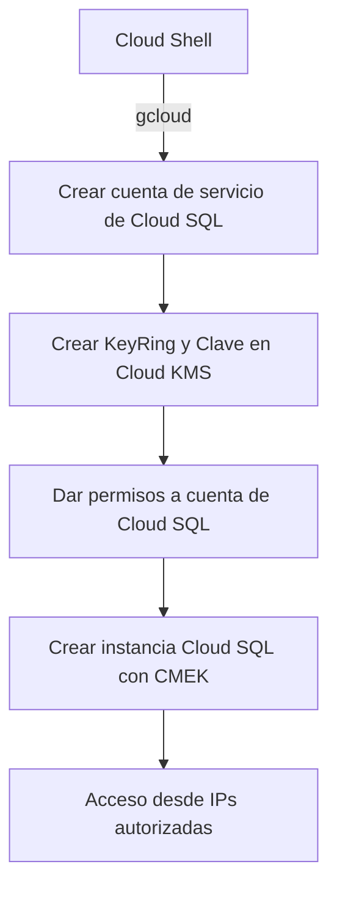

# ID GSP920

## 🧾 Descripción general del laboratorio

Este laboratorio práctico guía al usuario en la implementación de una solución segura y auditada para bases de datos PostgreSQL en Google Cloud, utilizando funcionalidades avanzadas de seguridad y cumplimiento.

A través de una serie de pasos estructurados, aprenderás a proteger una instancia de **Cloud SQL para PostgreSQL** mediante el uso de **Claves de Cifrado Administradas por el Cliente (CMEK)**, habilitar capacidades de auditoría detallada con **pgAudit**, y configurar la **autenticación IAM** para reforzar el control de acceso a nivel de base de datos.
 

## 🎯 Objetivos del laboratorio

Al finalizar este laboratorio, serás capaz de:

- **Configurar claves CMEK** en Cloud KMS y asociarlas a una instancia de Cloud SQL para PostgreSQL.
- **Implementar pgAudit** para registrar operaciones SQL críticas y cumplir con requisitos de auditoría.
- **Habilitar la autenticación IAM** para PostgreSQL, permitiendo el acceso a la base de datos mediante identidades gestionadas por Google Cloud IAM.

 

## 👥 Público objetivo

Este laboratorio está diseñado para:

- **Administradores de bases de datos (DBAs)** que gestionan entornos PostgreSQL en la nube.
- **Ingenieros de seguridad y cumplimiento** que requieren control criptográfico sobre los datos en reposo.
- **Arquitectos de soluciones en GCP** que buscan implementar prácticas recomendadas de seguridad y auditoría en entornos gestionados.

 

## 🧩 Componentes clave del laboratorio

| Componente | Descripción |
|------------|-------------|
| **CMEK (Customer-Managed Encryption Keys)** | Permite cifrar los discos de Cloud SQL con claves controladas por el cliente, almacenadas en Cloud KMS. |
| **Cloud KMS** | Servicio de gestión de claves criptográficas que permite crear, rotar y auditar claves de cifrado. |
| **pgAudit** | Extensión de PostgreSQL que proporciona capacidades avanzadas de auditoría a nivel de sentencia SQL. |
| **Autenticación IAM** | Permite que usuarios autenticados mediante IAM accedan a la base de datos sin necesidad de contraseñas tradicionales. |

---
 

## 🧠 Análisis estructurado del laboratorio


### 🔹 1. **Creación de la identidad de servicio para Cloud SQL**

```bash
export PROJECT_ID=$(gcloud config list --format 'value(core.project)')
gcloud beta services identity create \
    --service=sqladmin.googleapis.com \
    --project=$PROJECT_ID
```

#### ¿Qué hace?
- Crea una **cuenta de servicio administrada por Google** específica para Cloud SQL en tu proyecto.
- Esta cuenta es **necesaria para que Cloud SQL pueda acceder a la clave CMEK** en Cloud KMS.

#### ¿Por qué es importante?
- Cloud SQL **no puede usar claves CMEK** a menos que tenga una identidad propia con permisos explícitos sobre la clave.
- Esta cuenta tiene el formato:
  ```
  service-${PROJECT_NUMBER}@gcp-sa-cloud-sql.iam.gserviceaccount.com
  ```


### 🔹 2. **Creación del KeyRing y la clave en Cloud KMS**

```bash
export KMS_KEYRING_ID=cloud-sql-keyring
export ZONE=$(gcloud compute instances list --filter="NAME=bastion-vm" --format=json | jq -r .[].zone | awk -F "/zones/" '{print $NF}')
export REGION=${ZONE::-2}
export KMS_KEY_ID=cloud-sql-key

gcloud kms keyrings create $KMS_KEYRING_ID --location=$REGION
gcloud kms keys create $KMS_KEY_ID \
 --location=$REGION \
 --keyring=$KMS_KEYRING_ID \
 --purpose=encryption
```

#### ¿Qué hace?
- Crea un **contenedor lógico de claves** (KeyRing) y una **clave de cifrado simétrica** en Cloud KMS.
- Esta clave será usada para cifrar los discos de Cloud SQL.

#### ¿Por qué es importante?
- CMEK requiere que tú definas **dónde está la clave y cómo se accede a ella**.
- La clave debe estar en la **misma región** que la instancia de Cloud SQL.


### 🔹 3. **Asignación de permisos a la cuenta de Cloud SQL sobre la clave**

```bash
export PROJECT_NUMBER=$(gcloud projects describe ${PROJECT_ID} \
    --format 'value(projectNumber)')
	
gcloud kms keys add-iam-policy-binding $KMS_KEY_ID \
    --location=$REGION \
    --keyring=$KMS_KEYRING_ID \
    --member=serviceAccount:service-${PROJECT_NUMBER}@gcp-sa-cloud-sql.iam.gserviceaccount.com \
    --role=roles/cloudkms.cryptoKeyEncrypterDecrypter
```

#### ¿Qué hace?
- Le da a la cuenta de servicio de Cloud SQL el permiso para **cifrar y descifrar datos** con la clave CMEK.

#### ¿Por qué es importante?
- Sin este permiso, Cloud SQL **no podrá iniciar ni acceder a los discos cifrados** con esa clave.


### 🔹 4. **Obtención de IPs autorizadas**

```bash
	#  external IP address of the bastion-vm VM
export AUTHORIZED_IP=$(gcloud compute instances describe bastion-vm \
    --zone=$ZONE \
    --format 'value(networkInterfaces[0].accessConfigs.natIP)')
echo Authorized IP: $AUTHORIZED_IP

	# external IP address of the Cloud Shell
export CLOUD_SHELL_IP=$(curl ifconfig.me)
echo Cloud Shell IP: $CLOUD_SHELL_IP
```

#### ¿Qué hace?
- Obtiene las IPs públicas de:
  - La VM `bastion-vm` (entorno de desarrollo).
  - Tu sesión de Cloud Shell.

#### ¿Por qué es importante?
- Estas IPs se usarán para **permitir el acceso a la instancia de Cloud SQL** desde esos entornos.


### 🔹 5. **Creación de la instancia de Cloud SQL PostgreSQL con CMEK**

```bash
export KEY_NAME=$(gcloud kms keys describe $KMS_KEY_ID \
    --keyring=$KMS_KEYRING_ID --location=$REGION \
    --format 'value(name)')

export CLOUDSQL_INSTANCE=postgres-orders

gcloud sql instances create $CLOUDSQL_INSTANCE \
    --project=$PROJECT_ID \
    --authorized-networks=${AUTHORIZED_IP}/32,$CLOUD_SHELL_IP/32 \
    --disk-encryption-key=$KEY_NAME \
    --database-version=POSTGRES_13 \
    --cpu=1 \
    --memory=3840MB \
    --region=$REGION \
    --root-password=supersecret!
```

#### ¿Qué hace?
- Crea una instancia de PostgreSQL en Cloud SQL.
- Usa la clave CMEK que tú definiste para cifrar el disco.
- Autoriza el acceso desde las IPs obtenidas.

#### ¿Por qué es importante?
- **No puedes aplicar CMEK a una instancia ya existente**, debe hacerse al momento de la creación.
- Esta es la parte central del laboratorio: crear una base de datos cifrada con una clave que tú controlas.


## 🧩 Visualización del flujo




## ✅ Resultado final

Al terminar este laboratorio:

- Tienes una instancia de Cloud SQL cifrada con una clave que tú controlas.
- Puedes revocar el acceso a los datos **desactivando o eliminando la clave**.
- Cumples con requisitos de seguridad avanzados y regulaciones.


---

## 🧠 Habilitación y configuración de pgAudit en Cloud SQL para PostgreSQL


### 🔹 ¿Qué es pgAudit?

**pgAudit** (PostgreSQL Audit Extension) es una extensión oficial de PostgreSQL que permite realizar **auditoría detallada de operaciones SQL**, como:

- Lecturas (`SELECT`)
- Escrituras (`INSERT`, `UPDATE`, `DELETE`)
- Cambios de esquema (`DDL`)
- Accesos a funciones y roles

Es especialmente útil para entornos que requieren **cumplimiento normativo**, trazabilidad de acciones y análisis forense de actividad en bases de datos.


### 🔸 Objetivo de esta tarea

Configurar una instancia de **Cloud SQL para PostgreSQL** para:

1. Habilitar la extensión `pgAudit` mediante flags de instancia.
2. Reiniciar la instancia para aplicar los cambios.
3. Crear una base de datos (`orders`) y activar `pgAudit`.
4. Configurar auditoría por roles.
5. Poblar la base de datos con datos de ejemplo.
6. Ejecutar consultas y verificar los logs generados.


## 🧩 Desglose paso a paso del laboratorio


### 🟦 1. Habilitar flags de pgAudit en la instancia

```bash
gcloud sql instances patch $CLOUDSQL_INSTANCE \
    --database-flags cloudsql.enable_pgaudit=on,pgaudit.log=all
```

🔍 **¿Qué hace?**
- Activa la extensión `pgAudit` en la instancia.
- Configura el flag `pgaudit.log=all` para registrar todas las operaciones posibles.

📌 **Importante**: Este cambio requiere reiniciar la instancia para que los flags surtan efecto.


### 🟦 2. Reiniciar la instancia desde Cloud Console

 Path:  Navigation menu -> SQL -> Instance named "postgres-orders" ->  Cloud SQL Overview -> click Restart to restart the instance

🔍 **¿Qué hace?**
- Aplica los cambios de configuración.
- Asegura que `pgAudit` esté disponible en las sesiones de PostgreSQL.


### 🟦 3. Conectarse a la instancia desde Cloud Shell

  Path: Connect to this instance -> Open Cloud Shell.

🔍 **¿Qué hace?**
- Abre una sesión `psql` para interactuar con la base de datos.
- Usa la contraseña `supersecret!` para autenticarse como usuario `postgres`.


### 🟦 4. Crear la base de datos y activar pgAudit

```sql
CREATE DATABASE orders;
\c orders;
CREATE EXTENSION pgaudit;
ALTER DATABASE orders SET pgaudit.log = 'read,write';
```

🔍 **¿Qué hace?**
- Crea la base de datos `orders`.
- Activa la extensión `pgAudit`.
- Configura la auditoría para registrar operaciones de lectura y escritura.


### 🟦 5. Habilitar Audit Logging en Cloud Console

  Path: Cloud Console -> Navigation menu -> click IAM & Admin > Audit Logs.

🔍 **¿Qué hace?**
- Activa los logs de auditoría para Cloud SQL en el proyecto.
- Permite registrar eventos como `SELECT`, `INSERT`, `UPDATE`, etc., en **Cloud Logging**.


### 🟦 6. Poblar la base de datos con datos de ejemplo

```bash
export SOURCE_BUCKET=gs://cloud-training/gsp920
gsutil -m cp ${SOURCE_BUCKET}/create_orders_db.sql .
gsutil -m cp ${SOURCE_BUCKET}/DDL/distribution_centers_data.csv .
gsutil -m cp ${SOURCE_BUCKET}/DDL/inventory_items_data.csv .
gsutil -m cp ${SOURCE_BUCKET}/DDL/order_items_data.csv .
gsutil -m cp ${SOURCE_BUCKET}/DDL/products_data.csv .
gsutil -m cp ${SOURCE_BUCKET}/DDL/users_data.csv .
```

🔍 **¿Qué hace?**
- Descarga los scripts y archivos CSV necesarios de el bucket para poblar la base de datos `orders`.


### 🟦 7. Ejecutar el script de carga de datos

```bash
export CLOUDSQL_INSTANCE=postgres-orders
export POSTGRESQL_IP=$(gcloud sql instances describe $CLOUDSQL_INSTANCE --format="value(ipAddresses[0].ipAddress)")
export PGPASSWORD=supersecret!
psql "sslmode=disable user=postgres hostaddr=${POSTGRESQL_IP}" \
    -c "\i create_orders_db.sql"
```

🔍 **¿Qué hace?**
- Ejecuta el script SQL que crea las tablas y carga los datos en la base `orders`.


### 🟦 8. Configurar auditoría por rol

```sql
CREATE ROLE auditor WITH NOLOGIN;
ALTER DATABASE orders SET pgaudit.role = 'auditor';
GRANT SELECT ON order_items TO auditor;
```

🔍 **¿Qué hace?**
- Crea un rol `auditor` sin permisos de login.
- Configura `pgAudit` para registrar las acciones realizadas por ese rol.
- Asigna permisos de lectura sobre la tabla `order_items`.


### 🟦 9. Ejecutar consultas de ejemplo

```sql


-- Summary of orders by users
SELECT
    users.id  AS users_id,
    users.first_name  AS users_first_name,
    users.last_name  AS users_last_name,
    COUNT(DISTINCT order_items.order_id ) AS order_items_order_count,
    COALESCE(SUM(order_items.sale_price ), 0) AS order_items_total_revenue
FROM order_items
LEFT JOIN users ON order_items.user_id = users.id
GROUP BY 1, 2, 3
ORDER BY 4 DESC
LIMIT 500;


-- Summary by individual product
SELECT
    products.id  AS products_id,
    products.name  AS products_name,
    products.sku  AS products_sku,
    products.cost  AS products_cost,
    products.retail_price  AS products_retail_price,
    products.distribution_center_id  AS products_distribution_center_id,
    COUNT(DISTINCT order_items.order_id ) AS order_items_order_count,
    COALESCE(SUM(order_items.sale_price ), 0) AS order_items_total_revenue
FROM order_items
LEFT JOIN inventory_items ON order_items.inventory_item_id = inventory_items.id
LEFT JOIN products ON inventory_items.product_id = products.id
GROUP BY 1, 2, 3, 4, 5, 6
ORDER BY 7 DESC
LIMIT 500;

-- Orders by distribution center
SELECT
    order_items.order_id AS order_id,
    distribution_centers.id  AS distribution_centers_id,
    distribution_centers.name  AS distribution_centers_name,
    distribution_centers.latitude  AS distribution_centers_latitude,
    distribution_centers.longitude  AS distribution_centers_longitude
FROM order_items
LEFT JOIN inventory_items ON order_items.inventory_item_id = inventory_items.id
LEFT JOIN products ON inventory_items.product_id = products.id
LEFT JOIN distribution_centers ON products.distribution_center_id = distribution_centers.id
GROUP BY 1, 2, 3, 4, 5
ORDER BY 2
LIMIT 500;

```

🔍 **¿Qué hace?**
- Ejecuta una consulta que resume las órdenes por usuario.
- Esta operación será registrada por `pgAudit` si se realiza bajo el rol `auditor`.


### 🟦 10. Ver logs de pgAudit en Cloud Logging

 Path: Navigation menu -> View all products -> Observablity -> click Logging -> open the Logs Explorer

```sql
resource.type="cloudsql_database"
logName="projects/(GCP Project)/logs/cloudaudit.googleapis.com%2Fdata_access"
protoPayload.request.@type="type.googleapis.com/google.cloud.sql.audit.v1.PgAuditEntry"
```

🔍 **¿Qué hace?**
- Filtra los logs en Cloud Logging para mostrar entradas generadas por `pgAudit`.
- Permite visualizar qué consultas se ejecutaron, cuándo y por quién.


## ✅ Resultado final

Al completar esta tarea, tendrás:

- Una base de datos PostgreSQL en Cloud SQL con auditoría activada.
- Registro detallado de operaciones SQL en Cloud Logging.
- Capacidad para cumplir con requisitos de trazabilidad y seguridad.

---
